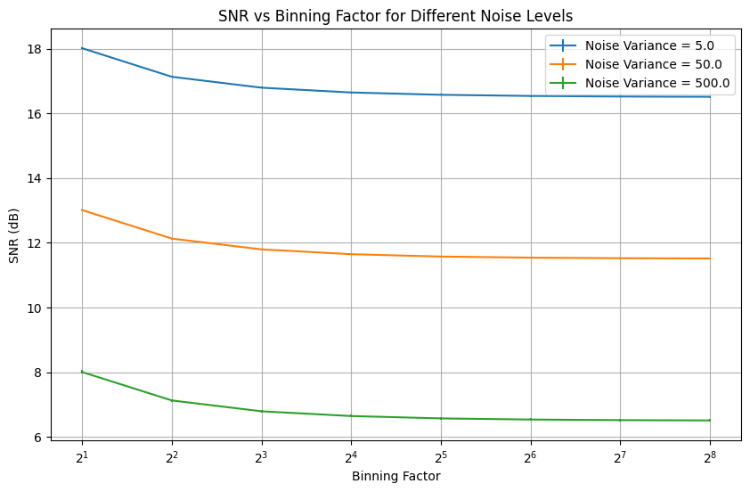

# Binning: Understanding the Process

## Abstract

This project explores binning in image processing to lower signal noise. Throughout the effort, the foundations of binning, how it works and the related pros and cons were explored. The project involves generating a vector, simulating repeated measurements under consistent conditions with added randomized noise. Binning is applied at various levels, and the resulting signal-to-noise ratio (SNR) is computed. The experiments are replicated 25 times for reliability, and statistical analyses are performed on the SNR values. The impact of changing noise variance, while keeping signal mean constant, is also examined. Comparative analysis of SNR results across different noise and binning levels provides insights into the relationship between SNR and binning.

## Introduction

Binning involves aggregating the charges of multiple pixels either horizontally, vertically, or both, creating a consolidated charge known as a "binned pixel" or "super pixel" \cite{nasibov2010performance}. This process typically includes adding the signals of adjacent pixels and converting the combined signal into digital values. The result is a reduction in noise and an enhancement of the signal-to-noise ratio (SNR). Binning is commonly used in various imaging applications, such as astronomy and microscopy, where improving SNR is crucial.

### How it Works

Let's consider a set of continuous data points, \(A = \{x_1, x_2, x_3, \ldots, x_n\}\) where the range of the data would be \( \text{Range} = \max(A) - \min(A) \) and Bin Width would be \( \text{Bin Width} = \frac{\text{Range}}{\text{Number of Bins}} \). Now for \(k\) number of beans where \(i\) is the iteration count, \[ \text{Bin}_i: \min(A) + (i-1) \times \text{Bin Width} \leq x < \min(A) + i \times \text{Bin Width} \]

This process results in binned data, where each bin represents a group of values from the original data set.

### Advantages of Binning

Binning in image processing offers several advantages, depending on the specific application. Some common advantages includes-

* Improved Signal-to-Noise Ratio (SNR) and Faster Image Acquisition
* Increased Sensitivity
* Reduced Readout Noise
* Data Compression
* Enhanced Image Quality
* Adaptability to System Constraints

In image acquisition, binning is employed to boost the signal-to-noise ratio (SNR) in the readout signal. Thus the combined charges would overcome the read noise, even if the individual pixel values are small. This is achieved by adding noise to the binned pixel, which consolidates the signals from multiple individual pixels \cite{aach1999digital, maolinbay2000additive}. Binning offers another advantage by enhancing the readout frame rate. By employing binning, the total frame rate of a system can be effectively increased. This is particularly useful for rapidly reading out highly binned low-resolution images when high speed is crucial \cite{zhou1997frame, bigas2006review}.

### Disadvantages of binning

While binning offers benefits such as improved signal-to-noise ratio (SNR) and increased frame rates, it also comes with certain disadvantages such as-

* Spatial Resolution Loss
* Color Information Loss
* Limited Flexibility

The enhanced noise performance is accompanied by a trade-off in spatial resolution. In color image sensors, binning is made complex by the existence of a color filter array (CFA). Data is usually acquired through a single CCD or CMOS sensor utilizing a CFA spatial sub-sampling process. This physical construction means that each pixel location measures only a single color. \cite{jin2012analysis}

## Code Implementation

### Requirements

In this section binning will be implemented as per the stated requirements-

* Generate a vector of length 10240 (assuming you’re repeatedly measuring the same signal under the same condition for 10240 times) with randomized noise added to each value. Reasonable scales of both signal (mean) and noise (variance) levels to be determined as needed to get enough precision level.
* Apply binning by 2, 4, 8, 16, 32, 64, 128, and 256 separately to the vector you just generated. Calculate the signal-over-noise ratio (SNR) in each case.
* Repeat previous steps at least 25 times to generate the replicated SNR results for each binning level and perform statistical analysis.
* Repeat previous steps by changing the noise (variance) level to 3 other values while keeping the mean constant.

## Result and Analysis

The experiment's outcomes were visualized and analyzed through the creation of Figure \ref{plotted}. In this graph, the blue line corresponds to a noise variance of 5.0, the orange line to a noise variance of 50.0, and the green line to a noise variance of 500.0. From the graph it's observed that-

* Noise Level 5.0:
  * SNR values generally increase with increasing binning level.
  * The increase in SNR is more pronounced for higher binning levels.
  * Overall, higher SNR values are observed.
* Noise Level 50.0:
  * Similar trends as noise level 5.0, but SNR values are lower.
  * The impact of noise is evident in reduced SNR, especially for higher binning levels.
* Noise Level 500.0:
  * SNR values are significantly lower across all binning levels.
  * The impact of high noise level is evident in the reduced ability to discern the signal.

From the observations it can be stated that higher binning levels generally lead to higher SNR, indicating improved signal-to-noise ratio and higher noise levels result in lower SNR, making it more challenging to extract the signal. For a given noise level, increasing the binning level can enhance the ability to extract the signal from the noisy data. The choice of binning level depends on the trade-off between data resolution and the need to reduce noise impact.

## Conclusion

This project investigates the code implementation of binning in image processing for noise reduction. Through experiments with varying noise levels and binning factors, the study reveals a direct relationship between noise reduction and increasing binning levels. Higher noise levels result in lower Signal-to-Noise Ratios (SNR), emphasizing the trade-off between noise reduction and data resolution. Advantages of binning, including improved SNR and faster image acquisition, are highlighted, but drawbacks such as spatial resolution loss and increased readout noise are acknowledged. The findings provide valuable insights for optimizing binning levels in image processing applications, balancing the need for noise reduction with the preservation of critical data details.

## References

**[ASS99]** Til Aach, Ulrich W Schiebel, and Gerhard Spekowius.Digital image acquisition and processing in medical x-ray imaging.Journal of Electronic Imaging, 8(1):7–22, 1999.

**[BCFS06]** M Bigas, Enric Cabruja, Josep Forest, and Joaquim Salvi. Review of cmos image sensors. Microelectronics journal, 37(5):433–451, 2006.

**[JH12]** Xiaodan Jin and Keigo Hirakawa.Analysis and processing of pixel binning for color image sensor.EURASIP Journal on Advances in Signal Processing, 2012:1–15, 2012.

**[Joh06 ]** Don H Johnson. Signal-to-noise ratio.Scholarpedia, 1(12):2088, 2006.

**[MEMA+00]** M Maolinbay, Y El-Mohri, LE Antonuk, K-W Jee, S Nassif, X Rong, and Q Zhao. Additive noise properties of active matrix flat-panel imagers.Medical physics, 27(8):1841–1854, 2000.

**[NKA+10]** Humbat Nasibov, Alisher Kholmatov, Basak Akselli, Adalat Nasibov, and Sakir Baytaroglu. Performance analysis of the ccd pixel binning option in particle-image velocimetry measurements.IEEE/ASME Transactions on Mechatronics, 15(4):527–540, 2010.

**[ZPF97]** Zhimin Zhou, Bedabrata Pain, and Eric R Fossum.Frame-transfer cmos active pixel sensor with pixel binning.IEEE Transactions on electron devices, 44(10):1764–1768, 1997.
